# DailyDo — Habit, Mood & Hydration Tracker

  
  
  

  A daily routine app for habits, moods, and hydration with a clean Android experience.

---

## Description

DailyDo is a dedicated mobile application designed to help users establish and maintain healthy routines, manage emotional well-being, and ensure proper hydration. It provides a practical set of tools for personal growth and daily accountability.

## Key Features

- Habit Tracker: Users can create and monitor personalized habits with visual progress bars and streak tracking to maintain motivation.
- Mood Journal: The emoji-based Mood Journal makes emotional logging simple and supports awareness over time with optional notes.
- Hydration Manager: Users can set a daily intake goal, check their current intake and progress percentage, and quickly log water with customizable amounts.
- Progress Summary: A daily summary screen shows Habit Avg, Mood Avg, and Hydration Avg so the user can review activity by date.
- Advanced Features & Data Persistence: Android SharedPreferences are used for secure and persistent local storage, keeping the app offline-friendly.
- User Management: Signup, Sign In, Settings, Notifications, Hydration settings, About, and Logout are included.

## Project Highlights

- Kotlin-first Android app with a clean modular package structure.
- Material-style UI with custom colors, shapes, and reusable drawables.
- ViewBinding enabled for safer and clearer view access.
- WorkManager and receivers used for reminders, boot handling, and background support.
- Navigation, RecyclerView, ViewPager2, and fragment-based screens keep the flow organized.
- Home screen widget support for quick habit progress checks.

## Tech Stack & Key Dependencies

### Core

- Kotlin — primary language
- Android SDK — targeted at API 24+
- Material Components — UI controls and styling

### Libraries

- AndroidX AppCompat, Core KTX, Activity, ConstraintLayout
- Fragment KTX and Navigation Component
- RecyclerView and CardView
- ViewPager2 for onboarding flows
- WorkManager for reminders and daily summary jobs
- Lifecycle ViewModel and LiveData
- MPAndroidChart for mood and progress charts

## Screenshots

### Launch Screen

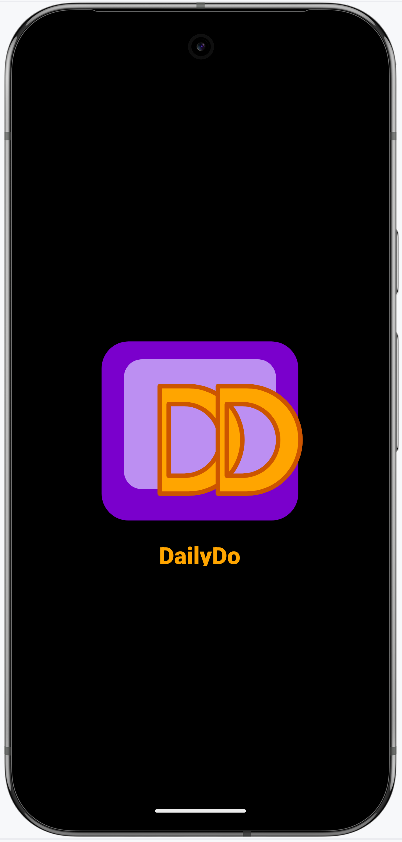

### Onboarding and Welcome

<table>
  <tr>
    <td>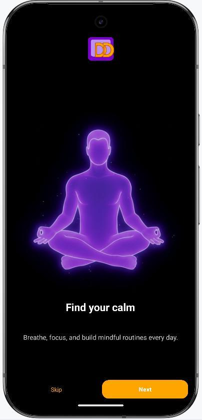</td>
    <td>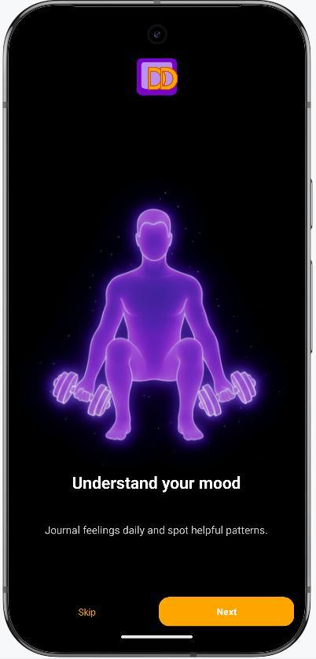</td>
    <td>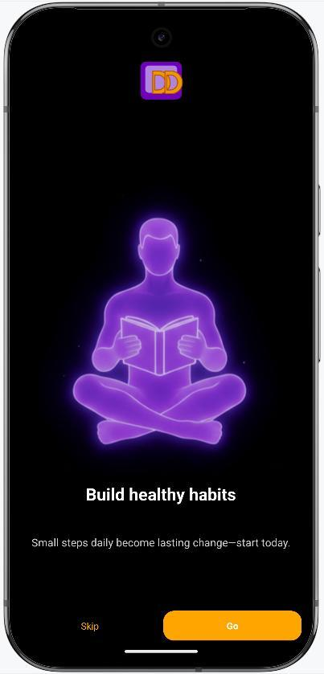</td>
    <td>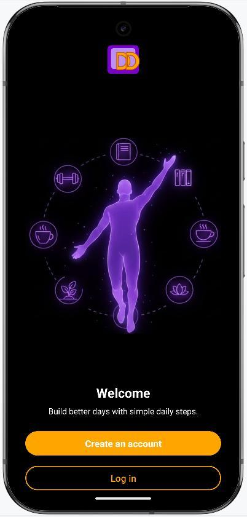</td>
  </tr>
</table>

### Signup, Sign In, Habit

<table>
  <tr>
    <td>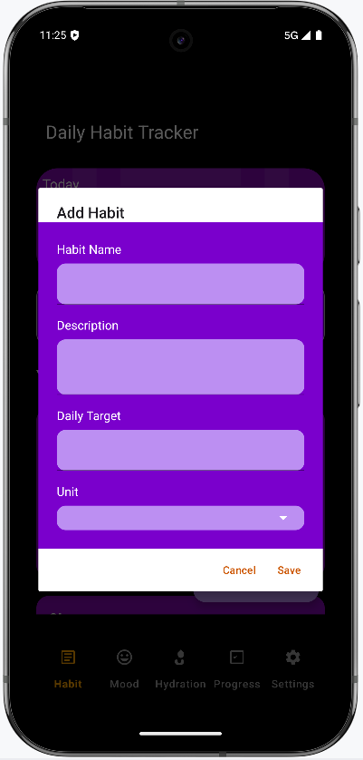</td>
    <td>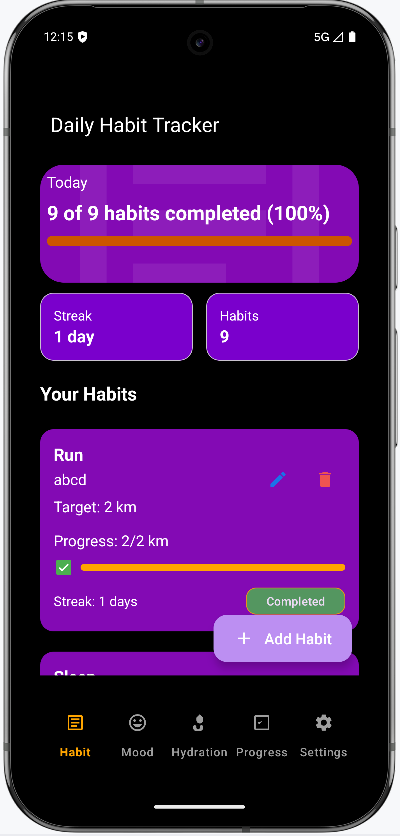</td>
    <td>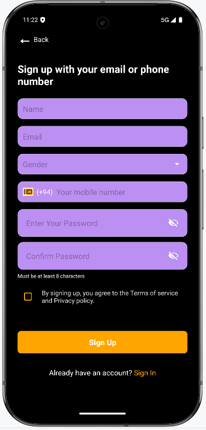</td>
    <td>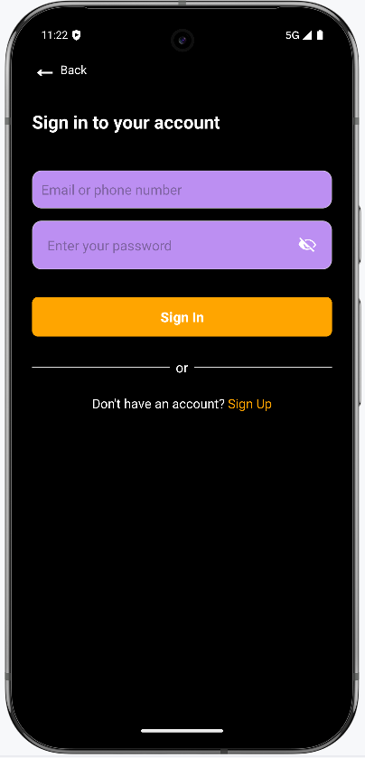</td>
  </tr>
</table>

### Mood and Hydration

<table>
  <tr>
    <td>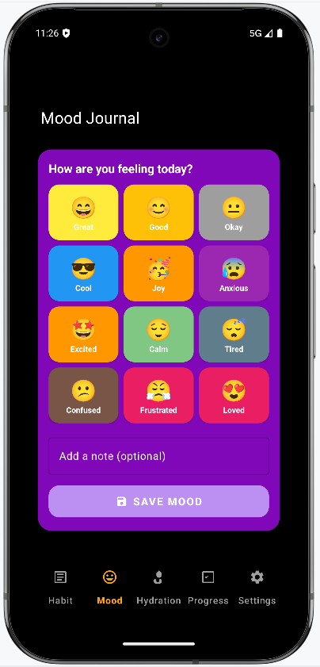</td>
    <td>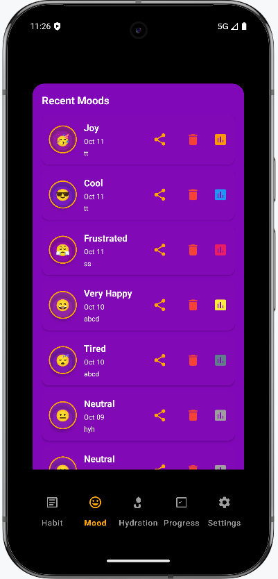</td>
    <td>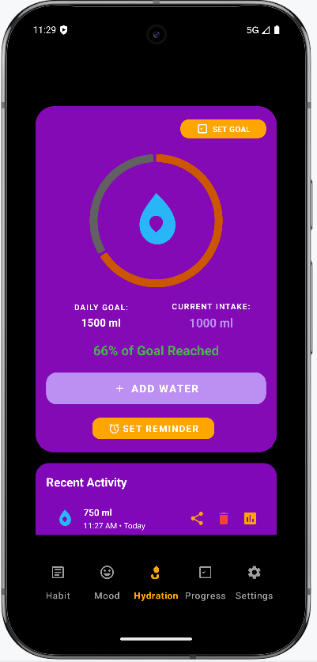</td>
    <td>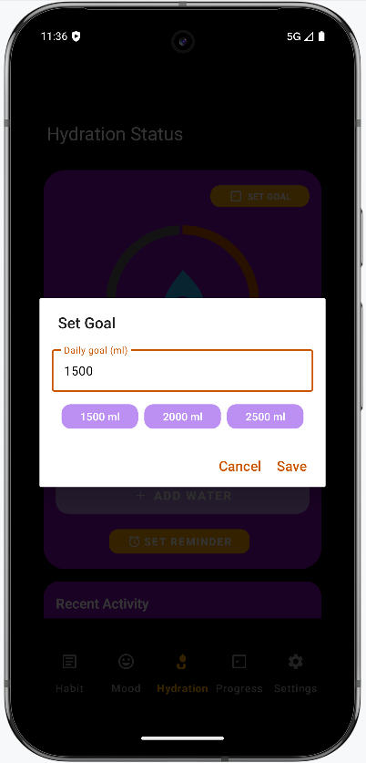</td>
  </tr>
</table>

### Reminders and Progress

<table>
  <tr>
    <td>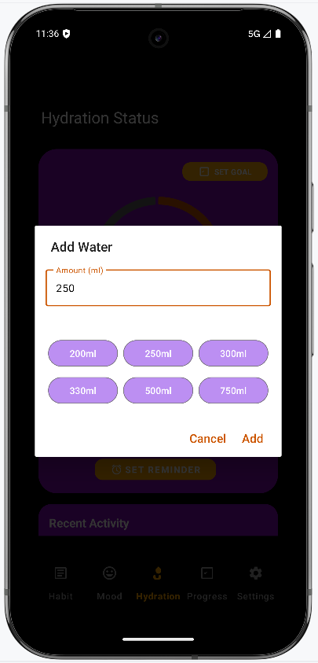</td>
    <td>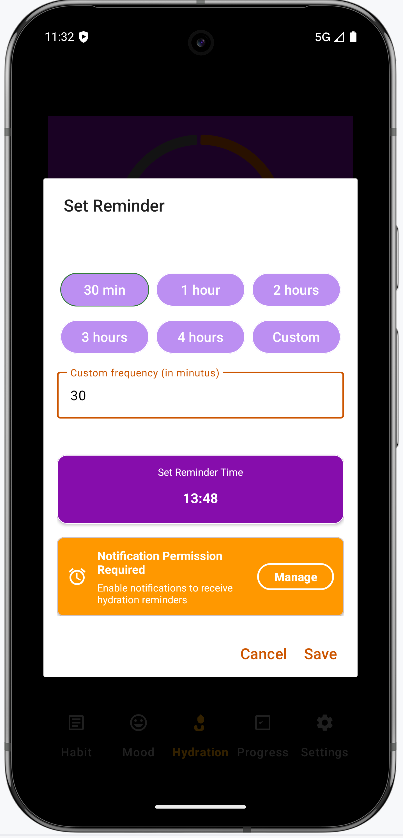</td>
    <td>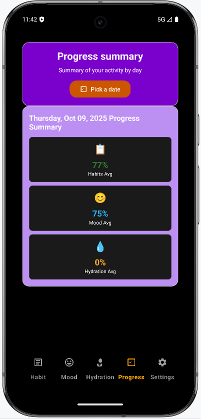</td>
    <td>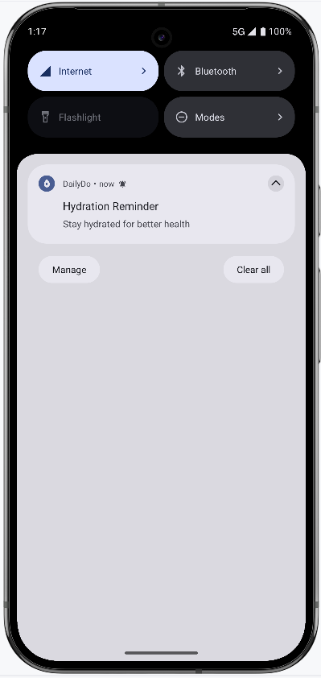</td>
  </tr>
</table>

### Settings and Date Picker

<table>
  <tr>
    <td>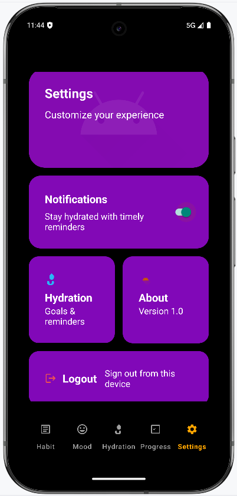</td>
    <td>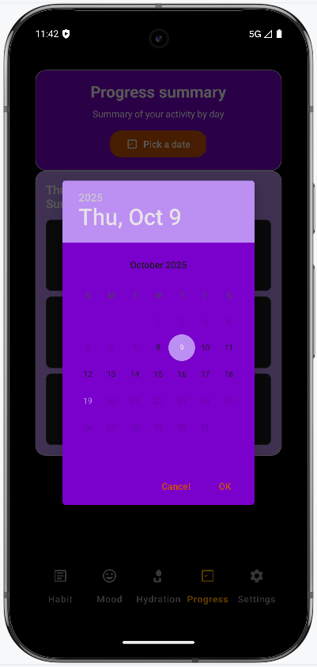</td>
  </tr>
</table>
